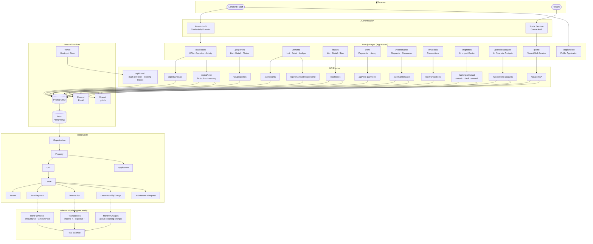

# GHM Architecture

> **To view this diagram:** Open this file in VS Code, then press `Ctrl+Shift+V` to open the Markdown Preview.

---

## Key Rules

| Rule | Detail |
|------|--------|
| **Balance = pure math** | `calculateLeaseBalance()` — no AI strings involved |
| **AI scope** | Import only: reads PDFs → populates records → done |
| **Auth split** | Landlord = NextAuth session · Tenant = cookie `portal_session` |
| **Decimals** | Always `Number(value)` before arithmetic — never raw Prisma Decimal |
| **Email from** | `onboarding@resend.dev` until custom domain is verified |
| **DB sync** | Always `npx prisma db push` — never `prisma migrate` |
